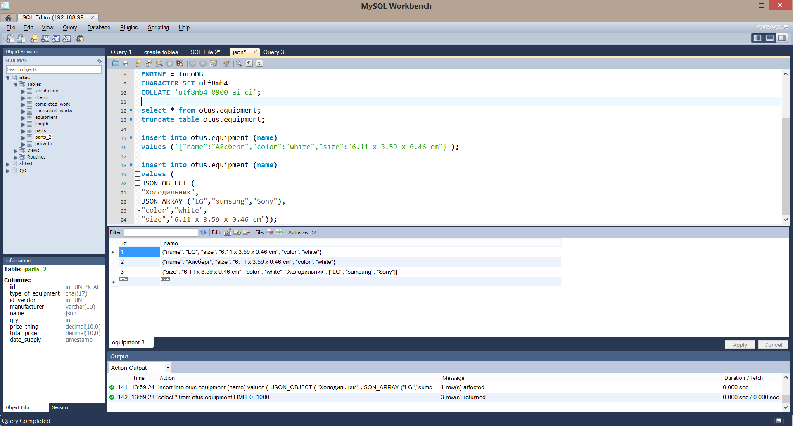

# MySQL_Otus
[Домашнее задание №1 (Создаем базу данных в докере) ](#1)

[Домашнее задание №2 (Типы данных) ](#2)

<a id="1">

## Домашнее задание №1 (Создаем базу данных в докере).

1. Поднять сервер, файл docker-compose.yml приложил:

>docker-compose up

2. Файл init.sql приложил.

3. Сервер запускается.

>docker@default:~$ ps -e | grep my  
 2468 ?        00:00:12 mysqld

>docker@default:~$ docker ps  
CONTAINER ID        IMAGE               COMMAND                  CREATED             STATUS                    PORTS                                     NAMES 
668ae6a75830        1504607f1ce7        "/entrypoint.sh --in…"   5 days ago          Up 30 minutes (healthy)   33060-33061/tcp, 0.0.0.0:3308->3306/tcp   mysql

4. Подключение с помощью Workbench

5. Файл my.cnf приложил

6. Sysbench.

InnoDB:

>SQL statistics: 
    queries performed: 
        read:                            10416 
        write:                           2974 
        other:                           1487 
        total:                           14877 
    transactions:                        743    (70.45 per sec.) 
    queries:                             14877  (1410.65 per sec.) 
    ignored errors:                      1      (0.09 per sec.) 
    reconnects:                          0      (0.00 per sec.) 

>General statistics: 
    total time:                          10.5430s 
    total number of events:              743 

>Latency (ms): 
         min:                                  312.97 
         avg:                                  890.60 
         max:                                 2226.10 
         95th percentile:                     1213.57 
         sum:                               661715.47 

>Threads fairness: 
    events (avg/stddev):           11.6094/0.80 
    execution time (avg/stddev):   10.3393/0.14 
	
MyiSAM:

>SQL statistics: 
    queries performed: 
        read:                            15302 
        write:                           2065 
        other:                           4493 
        total:                           21860 
    transactions:                        1093   (109.21 per sec.) 
    queries:                             21860  (2184.11 per sec.) 
    ignored errors:                      0      (0.00 per sec.) 
    reconnects:                          0      (0.00 per sec.) 

>General statistics: 
    total time:                          10.0056s 
    total number of events:              1093 

>Latency (ms): 
         min:                                    5.23 
         avg:                                    9.14 
         max:                                   33.61 
         95th percentile:                       13.22 
         sum:                                 9986.88 

>Threads fairness: 
    events (avg/stddev):           1093.0000/0.00 
    execution time (avg/stddev):   9.9869/0.00 	
</a>

[Оглавление](#contents)

<a id="2">

## Домашнее задание №2 (Типы данных).

>DROP TABLE otus.clients; 
CREATE TABLE otus.clients  
( 
  id INT UNSIGNED NOT NULL AUTO_INCREMENT, -- чтобы не было отрицательных значений. AUTO_INCREMENT автозаполнение. 
  name VARCHAR(40) NOT NULL, -- нефиксированная длинна 
  phone_number VARCHAR(20) NOT NULL, 
  address VARCHAR(255) NOT NULL, 
  PRIMARY KEY (id) 
) 
ENGINE = InnoDB 
CHARACTER SET utf8mb4 
COLLATE 'utf8mb4_0900_ai_ci'; 

>DROP TABLE otus.completed_work; 
CREATE TABLE otus.completed_work 
( 
    id INT UNSIGNED NOT NULL AUTO_INCREMENT, 
    id_clients INT UNSIGNED NOT NULL, -- UNSIGNED чтобы не попало отрицательное значение 
    id_works INT UNSIGNED NOT NULL, 
    works VARCHAR(255) NOT NULL, -- краткое описание выполненой работы 
    date_works TIMESTAMP NOT NULL, -- учитывает часовой пояс 
    type_of_equipment CHAR(17) NOT NULL, -- либо стиральная холодильник, либо стиральная машина, возможно это поле вообще стоит убрать т.к. есть таблица vocabulary_1 
    price_part DECIMAL  NOT NULL, 
    price_works DECIMAL   NOT NULL, 
    total_price DECIMAL  NOT NULL, 
	PRIMARY KEY (id) 
) 
ENGINE = InnoDB 
CHARACTER SET utf8mb4 
COLLATE 'utf8mb4_0900_ai_ci'; 

>DROP TABLE otus.contracted_works; 
CREATE TABLE otus.contracted_works 
( 
    id INT UNSIGNED NOT NULL AUTO_INCREMENT, -- UNSIGNED чтобы не попало отрицательное значение 
    id_clients INT UNSIGNED NOT NULL, -- UNSIGNED чтобы не попало отрицательное значение 
    insertdate TIMESTAMP NOT NULL, 
    breaking VARCHAR(255) NOT NULL, -- краткое описание поломки со слов заказчика 
    type_of_equipment CHAR(17) NOT NULL, -- либо стиральная холодильник, либо стиральная машина, возможно это поле вообще стоит убрать т.к. есть таблица vocabulary_1 
    departure TIMESTAMP NOT NULL, 
	PRIMARY KEY (id) 
) 
ENGINE = InnoDB 
CHARACTER SET utf8mb4 
COLLATE 'utf8mb4_0900_ai_ci'; 

>DROP TABLE otus.parts; 
CREATE TABLE otus.parts 
( 
    id INT UNSIGNED NOT NULL AUTO_INCREMENT, 
    type_of_equipment CHAR(17) NOT NULL, -- либо стиральная холодильник, либо стиральная машина, возможно это поле вообще стоит убрать т.к. есть таблица vocabulary_1 
    id_vendor INT UNSIGNED NOT NULL, -- поставщик 
    manufacturer VARCHAR(10) NOT NULL, -- фирма/производитель 
    name VARCHAR(20) NOT NULL, -- название запчасти 
    qty INT NOT NULL, -- кол-во в шт 
    price_thing DECIMAL NOT NULL, 
    total_price DECIMAL NOT NULL, 
    date_supply TIMESTAMP NOT NULL, 
    PRIMARY KEY (id) 
) 
ENGINE = InnoDB 
CHARACTER SET utf8mb4 
COLLATE 'utf8mb4_0900_ai_ci'; 

>DROP TABLE otus.provider; 
CREATE TABLE otus.provider 
( 
    id INT UNSIGNED NOT NULL AUTO_INCREMENT, 
    name VARCHAR(20) NOT NULL, 
    phone_number VARCHAR(20) NOT NULL, 
    address VARCHAR(255) NOT NULL, 
    PRIMARY KEY (id) 
) 
ENGINE = InnoDB 
CHARACTER SET utf8mb4 
COLLATE 'utf8mb4_0900_ai_ci'; 

>DROP TABLE otus.vocabulary_1; 
CREATE TABLE otus.vocabulary_1 
( 
	id INT UNSIGNED NOT NULL AUTO_INCREMENT, 
	name CHAR(17) NOT NULL, 
	PRIMARY KEY (id) 
) 
ENGINE = InnoDB 
CHARACTER SET utf8mb4 
COLLATE 'utf8mb4_0900_ai_ci'; 

1. Для всех id сделал INT UNSIGNED NOT NULL AUTO_INCREMENT.
2. Время сделал в TIMESTAMP.
3. Для денежных сумм сделал DECIMAL.
4. Номера телефонов сделал VARCHAR.
5. Практически во всех таблицах есть строка type_of_equipment тип даннх сделал CHAR(17), т.к. тут должны хранится только два значения.
Может эту строчку вообще убрать и связать с таблицей vocabulary_1, т.к. эта табилца содержит эти же самые значения?
6. Везде где исползую Int и не хочу иметь отрицательные значения, целессообразно использовать UNSIGNED?

JSON: 
1.Создал новую таблицу в которой содержится описание конечного оборудования (Холодильников).

>CREATE TABLE equipment 
( 
    id INT UNSIGNED NOT NULL AUTO_INCREMENT, 
    name JSON NOT NULL, 
    PRIMARY KEY (id) 
) 
ENGINE = InnoDB 
CHARACTER SET utf8mb4 
COLLATE 'utf8mb4_0900_ai_ci'; 

2. Заполнил данными: название ,цвет, размер:
Варииант №1
>insert into otus.equipment (name) 
values ('{"name":"Айсберг","color":"white","size":"6.11 x 3.59 x 0.46 cm"}');

Варииант №2
>insert into otus.equipment (name) 
values (  
JSON_OBJECT ( 
"Холодильник", 
JSON_ARRAY ("LG","sumsung","Sony"), 
"color","white", 
"size","6.11 x 3.59 x 0.46 cm")); 

Выборка:

</a>

[Оглавление](#contents)
