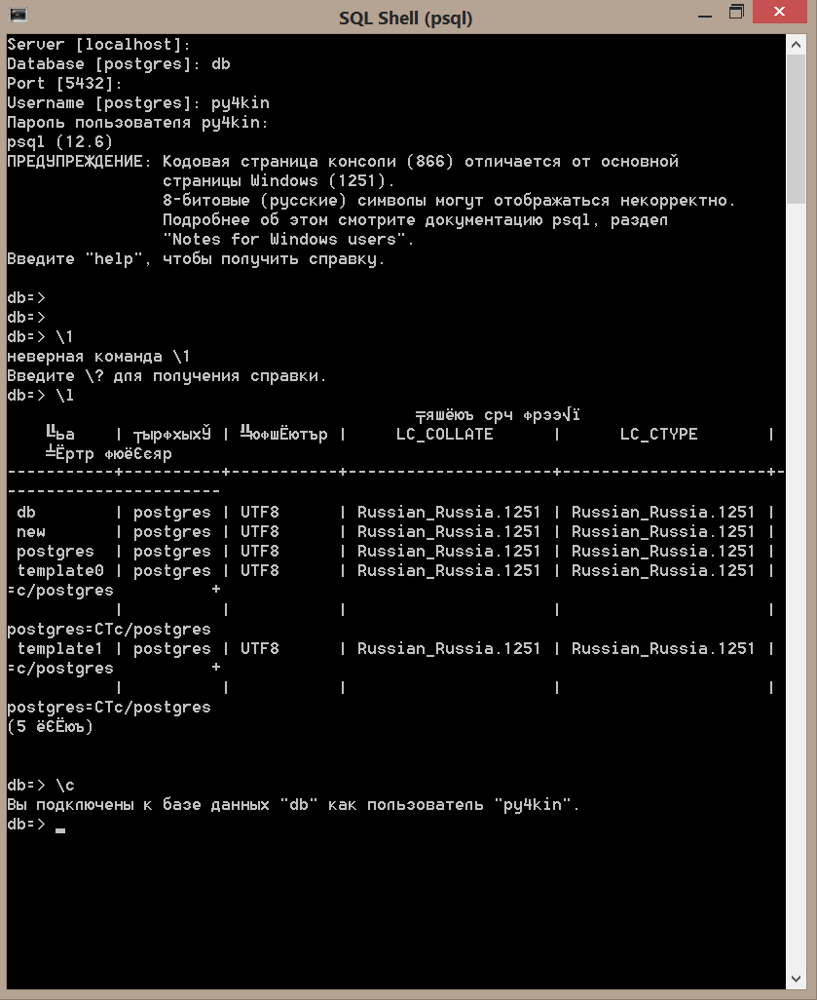
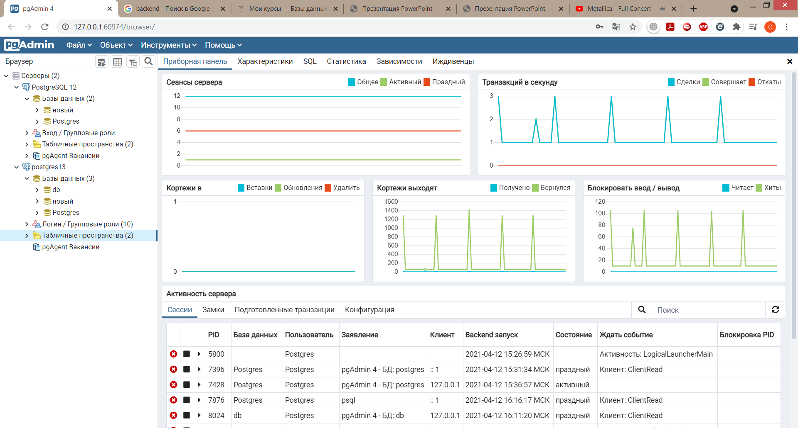
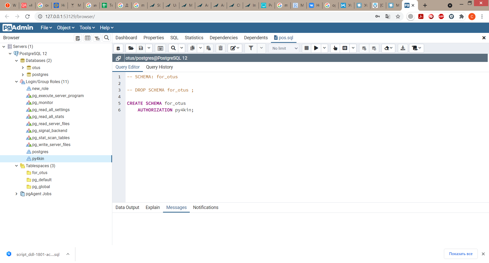
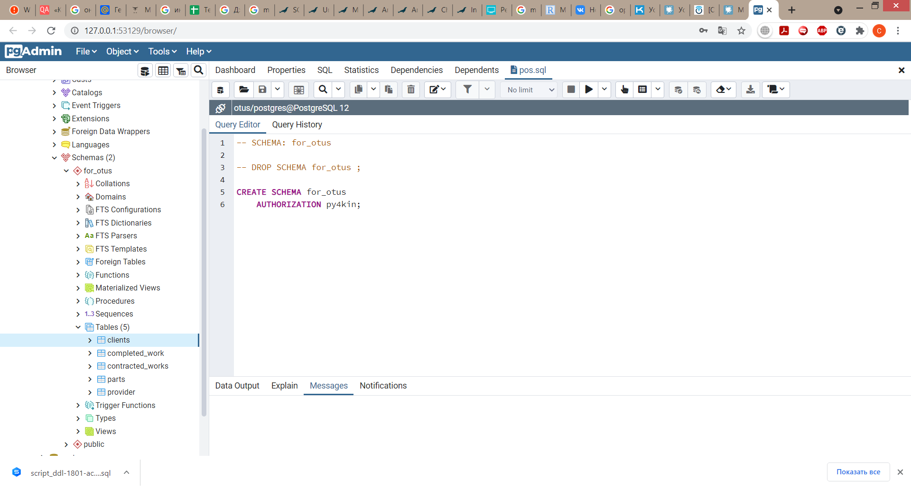
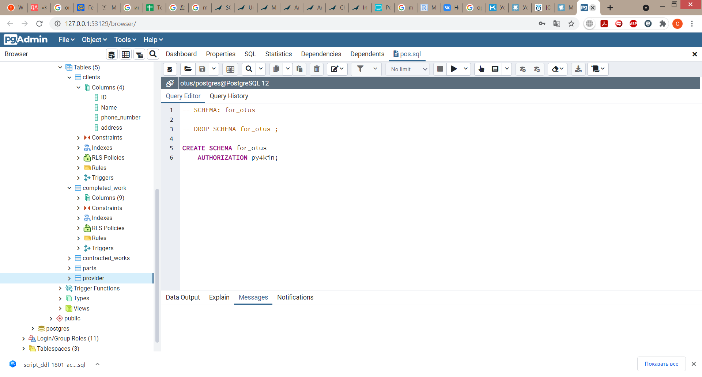

# Otus
[Домашнее задание №1 (Проектирование БД)](#1)

[Домашнее задание №2 (Компоненты современной СУБД)](#2)

[Домашнее задание №6 (Внутренняя архитектура СУБД PostgreSQL)](#6)

[Домашнее задание №7 (DDL: создание, изменение и удаление объектов в PostgreSQL)](#7)
<a id="1">
## Домашнее задание №1 (Проектирование БД)
### 1. Схема  		

	Понимаю что хорошим тоном является использовать латиские слова, буквы, обозначения, но это моя первая практика по этому сделано так (в будущем буду переделывать).
	Схему накидал в dbforgestudio, он почему требует подключение к БД. 
	БД у меня старая MySQL, не поддерживаются внешние ключи.

### 2. Документация
*Не разобрался я как делать документация "простую" через ПО, поэтому сделал так))))*
 * ***Таблица "Клиенты"***  
	В данную таблицу заносится информация о клиенте. Столбец ID - Первычный ключ.
	Таблица связанна с таблицей "Договоренность работ" по "Номер клиента"(client_id - внешний ключ) и с таблицей "Выполненые работы(чек) по "Номер клиента"(client_id).
 * ***Таблица "Договоренность работ"***  
	В данной таблице содержится информация о дате обращения клиента, описание проблемы, согласование выезда спецаилиста. Столбец ID - Первычный ключ. Столбец "Номер клиента" client_id - внешний ключ.
	Связана с таблице "Клиенты" по Id.
 * ***Таблица "Выполненые работы(чек)"*** 
	Таблица о выполненой работы специалистом. Предполагается что из данной таблице можно формировать "чек". Столбец ID - Первычный ключ. Столбец "Номер клиента" (client_id)и столбец "Тип обозначения" - внешние ключи.
	Связан с таблицей "Клиенты" по Id и с таблицей "Запчасти" по "Тип оборудование".
 * ***Таблица "Поставщики"*** 
	В данную таблицу заносится информация о поставщикке запчастей. Столбец ID - Первычный ключ.
	Таблица связанна с таблицей "Запчасти" по "Номер_поставщика"(supplier_id).
 * ***Таблица "Запчасти"*** 
	В данной таблице содержится описание запчастей, дата поставки, цена за штуку, тип. Столбец ID и "Тип оборудования" - Первычные ключи. Столбец "Номер_поставщика" - внешний ключ.
	Таблица связанна с таблицей "Поставщики" по Id и с таблицей "Выполненые работы(чек)" по "Тип оборудование".
 
### 3. Примеры бизнес-задач которые решает база.

Есть не большой город и близ лежашие деревни. В данном районе осуществляется ремонт, покупка и продажа Стиральных машин и Холодильного оборудования.
	Данный проект (БД) осуществляет сбор, хранения и обработку инфорции о проделанной, текущей и будущей работы.
	Позвонили "нам" рассказыли что сломалось, где сломалось. Договариваемся о дате выезда специалиста для ремонта, продажи, покупки оборудования.
	БД должна уметь хранить и выводить в читабельной форме информация о работах для предоставления тем или иным лицам.

### 4. Рекомендации к использованию репликации.
___Пока что не могу дать ответа.___  

Для данного объема работ думаю репликация будет излишней.
Я понимаю что такое репликация и как отличаются, но не могу сообразить как и какую применить для данного проекта.
### 5. Рекомендации к резервному копированию.
___Пока что не могу дать ответа.___
</a>

[Оглавление](#contents)
<a id="2">
## Домашнее задание №2 (Компоненты современной СУБД)
</a>

[Оглавление](#contents)
<a id="6">
## Домашнее задание №6 (Внутренняя архитектура СУБД PostgreSQL)

Сервер PostgreSQL был установлен на Windows. 
Созданы:
1.	Новый сервер (postgres13)
2.	БД "New","db"
3.	Пользователь "py4kin" с ограниченными правами. (Фамилия моя Ручкин, поэтому py4kin)))) 
### 1. SQL Shell (Командная строка)  

На первом скриншоте подключение к серверу у базе данных "db" через пользователя "py4kin". 
P.s. Кодировку не менял.

### 2. pgAdmin  
 

На втором скриншоте подключение к серверу через pgAdmin.
</a>

[Оглавление](#contents)
<a id="7">
## Домашнее задание №7 (DDL: создание, изменение и удаление объектов в PostgreSQL)
1.	Создана БД - "Otus"

>DROP DATABASE otus; 
CREATE DATABASE otus 
    WITH  
    OWNER = py4kin 
    ENCODING = 'UTF8' 
    LC_COLLATE = 'Russian_Russia.1251' 
    LC_CTYPE = 'Russian_Russia.1251' 
    TABLESPACE = for_otus 
    CONNECTION LIMIT = -1;

2. Табличное пространство - "for_otus"

>DROP TABLESPACE for_otus; 
CREATE TABLESPACE for_otus 
  OWNER py4kin 
  LOCATION 'C:\Program Files\PostgreSQL\12\data'; 
  
>ALTER TABLESPACE for_otus 
OWNER TO py4kin; 
		
3. Роль/пользователь - "py4kin"

>DROP ROLE py4kin; 
CREATE ROLE py4kin WITH 
  LOGIN 
  SUPERUSER 
  INHERIT 
  CREATEDB 
  CREATEROLE 
  REPLICATION 
  ENCRYPTED PASSWORD 'md5ab55bbce6782540fbdc80f2301ef24fd'; 

>GRANT new_role TO py4kin; 
GRANT pg_monitor TO py4kin WITH ADMIN OPTION 

4. Схема данных - "for_otus"

>DROP SCHEMA for_otus ; 
CREATE SCHEMA for_otus 
    AUTHORIZATION py4kin;

5. Таблицы из домашнего задания №1

>DROP TABLE for_otus.clients; 
CREATE TABLE for_otus.clients 
( 
    "ID" integer[] NOT NULL, 
    "Name" "char" NOT NULL, 
    phone_number "char" NOT NULL, 
    address "char" NOT NULL, 
    CONSTRAINT clients_pkey PRIMARY KEY ("ID") 
        USING INDEX TABLESPACE for_otus 
) 
TABLESPACE for_otus; 
ALTER TABLE for_otus.clients 
OWNER to py4kin;
	
>DROP TABLE for_otus.completed_work; 
CREATE TABLE for_otus.completed_work 
( 
    id integer NOT NULL, 
    id_clients integer NOT NULL, 
    id_works integer NOT NULL, 
    works text COLLATE pg_catalog."default" NOT NULL, 
    date_works timestamp with time zone NOT NULL, 
    "Type_of_equipment" "char" NOT NULL, 
    price_part character(1) COLLATE pg_catalog."default" NOT NULL, 
    price_works character(1) COLLATE pg_catalog."default" NOT NULL, 
    total_price character(1) COLLATE pg_catalog."default" NOT NULL, 
    CONSTRAINT completed_work_pkey PRIMARY KEY (id) 
        USING INDEX TABLESPACE for_otus 
) 
TABLESPACE for_otus; 
ALTER TABLE for_otus.completed_work 
    OWNER to py4kin;
	
>DROP TABLE for_otus.contracted_works; 
CREATE TABLE for_otus.contracted_works 
( 
    id integer NOT NULL, 
    id_clients integer NOT NULL, 
    insertdate timestamp with time zone NOT NULL, 
    breaking text COLLATE pg_catalog."default" NOT NULL, 
    "Type_of_equipment" "char" NOT NULL, 
    " departure" timestamp with time zone NOT NULL, 
    CONSTRAINT "Contracted_works_pkey" PRIMARY KEY (id) 
        USING INDEX TABLESPACE for_otus 
) 
TABLESPACE for_otus; 
ALTER TABLE for_otus.contracted_works 
    OWNER to py4kin;
	
>DROP TABLE for_otus.parts; 
CREATE TABLE for_otus.parts 
( 
    id integer NOT NULL, 
    type_of_equipment "char" NOT NULL, 
    id_vendor integer NOT NULL, 
    manufacturer "char" NOT NULL, 
    name "char" NOT NULL, 
    qty integer NOT NULL, 
    price_thing "char" NOT NULL, 
    total_price "char" NOT NULL, 
    date_supply timestamp with time zone NOT NULL, 
    CONSTRAINT parts_pkey PRIMARY KEY (id) 
        USING INDEX TABLESPACE for_otus 
) 
TABLESPACE for_otus; 
ALTER TABLE for_otus.parts 
    OWNER to py4kin;
	
>DROP TABLE for_otus.provider; 
CREATE TABLE for_otus.provider 
( 
    id integer NOT NULL, 
    name "char" NOT NULL, 
    phone_number "char" NOT NULL, 
    address "char" NOT NULL, 
    CONSTRAINT provider_pkey PRIMARY KEY (id) 
        USING INDEX TABLESPACE for_otus 
) 
TABLESPACE for_otus; 
ALTER TABLE for_otus.provider 
    OWNER to py4kin; 

*Скриншоты выполненой работы.*

</a>

[Оглавление](#contents)
