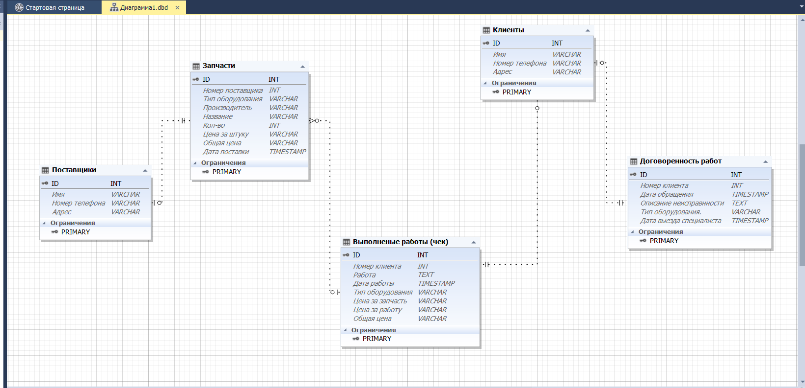

# Otus
[Домашнее задание №1](#1)

[Домашнее задание №2](#2)
<a id="1">
## Домашнее задание №1
1. Схема
2. Документация
 * ***Таблица "Клиенты"***  
	В данную таблицу заносится информация о клиенте. 
	Таблица связанна с таблицей "Договоренность работ" по "Номер клиента"(client_id) и с таблицей "Выполненые работы(чек) по "Номер клиента"(client_id).
 * ***Таблица "Договоренность работ"***  
	В данной таблице содержится информация о дате обращения клиента, описание проблемы, согласование выезда спецаилиста.
	Связана с таблице "Клиенты" по Id.
 * ***Таблица "Выполненые работы(чек)"*** 
	Таблица о выполненой работы специалистом. Предполагается что из данной таблице можно формировать "чек".
	Связан с таблицей "Клиенты" по Id и с таблицей "Запчасти" по "Тип оборудование".
 * ***Таблица "Поставщики"*** 
	В данную таблицу заносится информация о поставщикке запчастей. 
	Таблица связанна с таблицей "Запчасти" по "supplier_id".
 * ***Таблица "Запчасти"*** 
	В данной таблице содержится описание запчастей, дата поставки, цена за штуку, тип.
	Таблица связанна с таблицей "Поставщики" по Id и с таблицей "Выполненые работы(чек)" по "Тип оборудование".
 
3. Примеры бизнес-задач которые решает база
4. Рекомендации к использованию репликации
5. Рекомендации к резервному копированию
</a>

[Оглавление](#contents)
<a id="2">
## Домашнее задание №2
1. Схема
2. Док
3.
</a>

[Оглавление](#contents)
