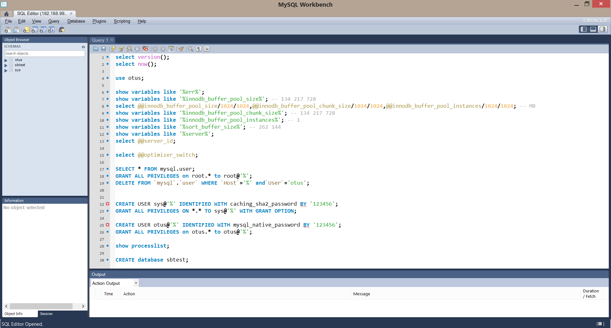

# MySQL_Otus
[Домашнее задание №1 (Создаем базу данных в докере) ](#1)

<a id="1">

## Домашнее задание №1 (Создаем базу данных в докере).

1. Поднять сервер, файл docker-compose.yml приложил:

>docker-compose up

2. Файл init.sql приложил.

3. Сервер запускается.

>docker@default:~$ ps -e | grep my  
 2468 ?        00:00:12 mysqld

>docker@default:~$ docker ps  
CONTAINER ID        IMAGE               COMMAND                  CREATED             STATUS                    PORTS                                     NAMES 
668ae6a75830        1504607f1ce7        "/entrypoint.sh --in…"   5 days ago          Up 30 minutes (healthy)   33060-33061/tcp, 0.0.0.0:3308->3306/tcp   mysql

4. Подключение с помощью Workbench

5. Файл my.cnf приложил

6. Sysbench.

InnoDB:

>SQL statistics: 
    queries performed: 
        read:                            10416 
        write:                           2974 
        other:                           1487 
        total:                           14877 
    transactions:                        743    (70.45 per sec.) 
    queries:                             14877  (1410.65 per sec.) 
    ignored errors:                      1      (0.09 per sec.) 
    reconnects:                          0      (0.00 per sec.) 

>General statistics: 
    total time:                          10.5430s 
    total number of events:              743 

>Latency (ms): 
         min:                                  312.97 
         avg:                                  890.60 
         max:                                 2226.10 
         95th percentile:                     1213.57 
         sum:                               661715.47 

>Threads fairness: 
    events (avg/stddev):           11.6094/0.80 
    execution time (avg/stddev):   10.3393/0.14 
	
MyiSAM:

>SQL statistics: 
    queries performed: 
        read:                            15302 
        write:                           2065 
        other:                           4493 
        total:                           21860 
    transactions:                        1093   (109.21 per sec.) 
    queries:                             21860  (2184.11 per sec.) 
    ignored errors:                      0      (0.00 per sec.) 
    reconnects:                          0      (0.00 per sec.) 

>General statistics: 
    total time:                          10.0056s 
    total number of events:              1093 

>Latency (ms): 
         min:                                    5.23 
         avg:                                    9.14 
         max:                                   33.61 
         95th percentile:                       13.22 
         sum:                                 9986.88 

>Threads fairness: 
    events (avg/stddev):           1093.0000/0.00 
    execution time (avg/stddev):   9.9869/0.00 	
</a>

[Оглавление](#contents)
